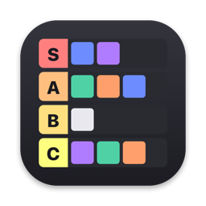
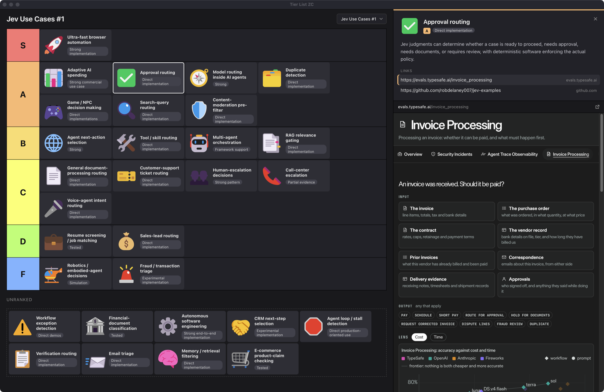

<p align="center">
  
</p>

# Tier List ZC

A drag-and-drop tier list app for macOS that your AI agent can build and edit for you.

Ask Claude Code or Codex to "make a tier list of these use cases", paste a list of links, and the agent writes the list. You rank it by dragging cards between tiers. Click a card to read its summary with its first link open in a built-in browser.

<p align="center">
  
</p>

## Features

- **Two kinds of list.** Image tiles (movies, games, products), or text cards with an icon, a title, a tag, a summary and links.
- **A browser beside your list.** Clicking a card shows its details on the right and loads its first link in a real WebKit browser below them, with full JavaScript and logins that persist across launches.
- **Agent-friendly.** Every list is a plain JSON file, edited by a small CLI (`tl.js`). The open app picks up changes within about 2 seconds, so you can watch your agent build the list.
- **Local and simple.** A single Swift file, no server, no dependencies. Your lists stay in the repo folder.

## Requirements

- macOS 14 or later, with the Xcode Command Line Tools (`xcode-select --install`)
- Node 24 for the `tl.js` CLI

## Quick start

```sh
git clone https://github.com/zazencodes/tierlist.git
cd tierlist
./mac/build.sh
open "build/Tier List ZC.app"
```

The app is built into `build/` and runs from there. It reads your lists from the repo, so keep it in place.

## Using it with an agent

The repo ships three skills in `.agents/skills/` (`.claude/skills` links to them):

- `new-tierlist`: "make a tier list of Pixar movies" or "turn these links into a tier list"
- `edit-tierlist`: "add Toy Story 4", "move X to S tier", "rename the tiers"
- `open-tierlist`: builds the app if needed and opens it

## Using the CLI

`./tl.js` edits the current list (its slug is stored in the `current` file). Run it with no arguments to see all commands.

```sh
./tl.js new "Pixar Movies"                     # create a list and make it current
./tl.js add "Up" "https://…/up-poster.jpg"     # add an image tile
./tl.js add-cards < cards.json                 # add text cards from JSON
./tl.js place "Up" S                           # move an item to a tier
./tl.js use pixar-movies                       # switch the current list
```

Each list lives in `lists/<slug>/` as `tierlist.json` plus an `images/` folder. Delete the folder to delete the list.

## In the app

- Drag items between tiers. Changes save to `tierlist.json` right away.
- Click a text card to open it in the right pane. Click its other links to load them below.
- ↗ opens the current page in your default browser. × or Esc closes the pane.
- Drag the pane's left edge to resize it.
- ⌘R reloads the UI. The UI is `public/index.html`, loaded at runtime, so editing it needs no rebuild.

## License

[MIT](LICENSE)

<p align="center">
  <a href="https://zazencodes.com/?utm_source=github&utm_medium=referral&utm_campaign=tierlist">
    
  </a>
  <br>
  Created by <a href="https://zazencodes.com/">ZazenCodes</a>
</p>
